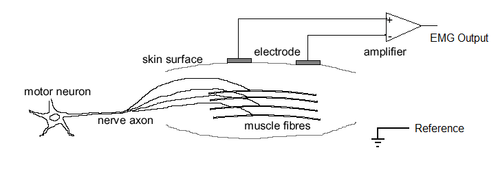
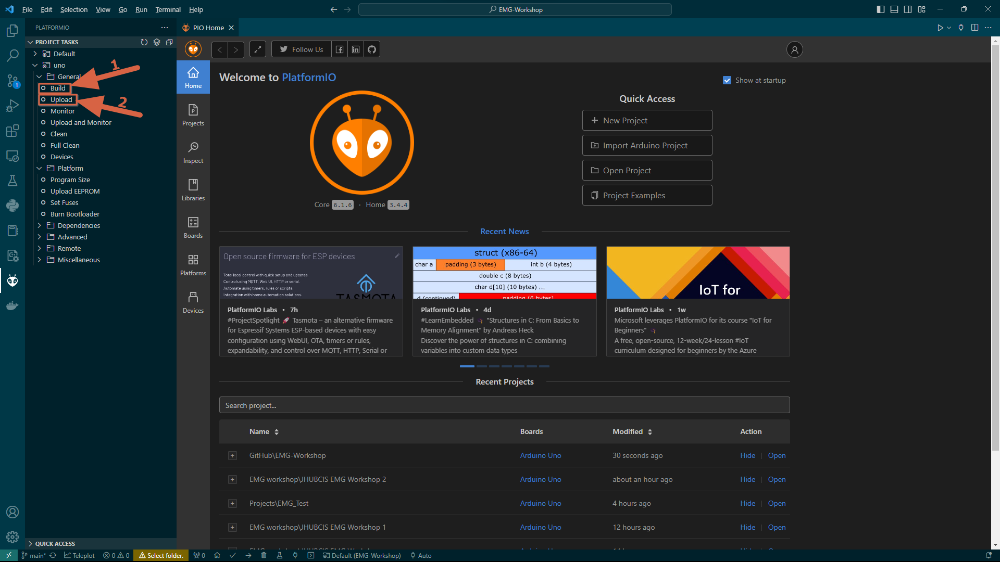

# EMG-Workshop

by JHUBCIS 2023.9

## Dependencies

- [Visual Studio Code (VS Code)](https://code.visualstudio.com/) 
  - One of the best IDEs out there, incredibly versatile. Definitely beats ArduinoIDE.
  - Works across Windows, Mac and Linux.
- [PlatformIO IDE](https://marketplace.visualstudio.com/items?itemName=platformio.platformio-ide) 
  - A VS Code extension that will practically allow you to work with any microcontroller (up to 1490 different kinds, definitely including many variants of Arduino, Adafruit, Attiny and Raspberry Pi). This is another major reason why we do not use ArduinoIDE.
- [Teleplot](https://marketplace.visualstudio.com/items?itemName=alexnesnes.teleplot)
  - “A ridiculously simple tool to plot telemetry data from a running program and trigger function calls.”
  - This is another VS Code extension that can practically plot any kind of serial input data. Works great with PlatformIO IDE.

## Documentations 

These documentations should help you better understand the hardware and software used in this workshop.

### Hardware and Accompanying Libraries

- [Seeeduino v4.2](https://wiki.seeedstudio.com/Seeeduino_v4.2/) 
  - This is the microcontroller unit (MCU) developing board that we are using for the workshop, which is very similar to [Arduino UNO R3](https://docs.arduino.cc/hardware/uno-rev3). They are both based on the [Atmega328](https://en.wikipedia.org/wiki/ATmega328) microcontroller family.
- [Base Shield V2](https://wiki.seeedstudio.com/Base_Shield_V2/) 
  - This conveniently remaps the pins of the Seeeduino (or Arduino UNO R3) to sockets for [Grove](https://wiki.seeedstudio.com/Grove_System/) modular components, no more jumper wires!
- [Grove - EMG Detector](https://wiki.seeedstudio.com/Grove-EMG_Detector/) 
  - The EMG sensor used in this workshop.

### Arduino Libraries

- [Servo](https://github.com/arduino-libraries/Servo)
  - Allows Arduino boards to control a variety of servo motors.
- [RunningAverage](https://github.com/RobTillaart/RunningAverage?utm_source=platformio&utm_medium=piohome)
  - The library stores the last N individual values in a circular buffer to calculate the running average.
- [NoDelay](https://github.com/M-tech-Creations/NoDelay?utm_source=platformio&utm_medium=piohome)
  - Arduino library to make use of the Millis function for non blocking delays.
  - In this case, we use this so that the servo does not get updated too often so that its interference to the analog input significantly affects performance.

### Private Library

- [EMA_Filters](https://github.com/JHUBCIS/EMG-Workshop/blob/main/lib/EMA_Filters/README.md)
  - implements a lowpass filter, a highpass filter, and a bandpass filter using [exponential moving average (EMA)](https://en.wikipedia.org/wiki/Exponential_smoothing), inspired by [this tutorial](https://www.norwegiancreations.com/2016/03/arduino-tutorial-simple-high-pass-band-pass-and-band-stop-filtering/).
  - calculate the smoothing factor $\alpha$ for EMA from the cutoff frequency and the sampling frequency, based on [this formula](https://en.wikipedia.org/wiki/Low-pass_filter#Simple_infinite_impulse_response_filter).

## Overview

- Here is a flowchart of how this demo works

  

## Tutorial

### Getting Started

1. First of all, please install VS Code and the relevant extensions in the **Dependencies** section.
   - The links in the Dependencies section should contain enough instruction. Here’s an official tutorial on how to [install extensions for VS Code](https://code.visualstudio.com/docs/editor/extension-marketplace#:~:text=You%20can%20browse%20and%20install,on%20the%20VS%20Code%20Marketplace.).
2. See this tutorial on [getting started with PlatformIO IDE](https://dronebotworkshop.com/platformio/). It goes quite in depth on how to work with PlarformIO, and contains details in the context of VS Code.

### Working with Grove EMG

- The Grove EMG is a **bipolar EMG**, meaning that it acquires an EMG signal by measuring voltages between each of the two EMG surface detection electrodes (red, white) and the reference electrode (black). 

  

- Specifically, the surface EMG electrodes should be placed only  1– 2 cm apart between the motor unit and the tendinous insertion of the muscle, along the  longitudinal midline of the muscle. 

  - **For this project, we recommend placing the electrodes on the bicep.** 
    - **Red electrode: at the bulk of the muscle**
    - **White electrode: at the tendinous insertion**
    - **Black electrode: at the bottom of the elbow for reference**

### Setting up the EMG-Workshop project

1. Then download this [EMG-Workshop](https://github.com/JHUBCIS/EMG-Workshop) repo as a zip file to your computer. See this [link](https://docs.github.com/en/repositories/working-with-files/using-files/downloading-source-code-archives#downloading-source-code-archives) for how to do so. Then unzip the folder to a location of your liking.

2. See this [official tutorial for VS Code](https://code.visualstudio.com/docs/introvideos/basics) on how to open the folder in VS Code as a Workspace. 

3. If all is installed properly, you should be able to see a window similar to this:

   

4. Plug in your Arduino Uno (or Seeeduino) to your computer. PlatformIO should automatically identify the COM port that connects to the microcontroller. 

5. First click on “**Build**”, then click on “**Upload**” to run the code on your Arduino (Seeeduino).

   

6. Now the Arduino (Seeeduino) should be running the code!

### Visualizing with Teleplot

1. On the bottom left corner, of the window, click on “**Teleplot**”.

   

2. The settings for serial plotting are at the upper left corner of the Teleplot page. 

   

3. Make sure the baud rate is `115200`. Also select the COM port that your Arduino (Seeeduino) is connected to. Then click “**Open**”,

   

4. A collapsed serial monitor should show at the right of the Teleplot page. 

   

   - Click on it to expand, and you should see a countdown for calibration. Click on “**Reduce**” to collapse it again.

     

5. Once Calibration is complete, serial plots for the bandpass filtered EMG signal and the envelope of this signal should be displayed. Play around with the settings as you like.

   - We recommend using “light mode”, which can be set at the top right corner of the Teleplot page. 
   - If you want to re-calibrate, go to the settings for serial plotting, “Close” then “Open”. **Please fully relax your muscle during the calibration.** 

   