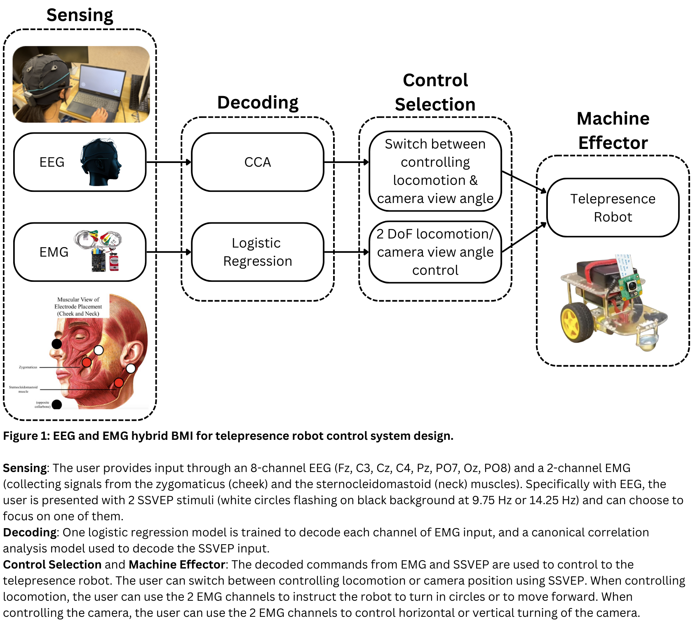
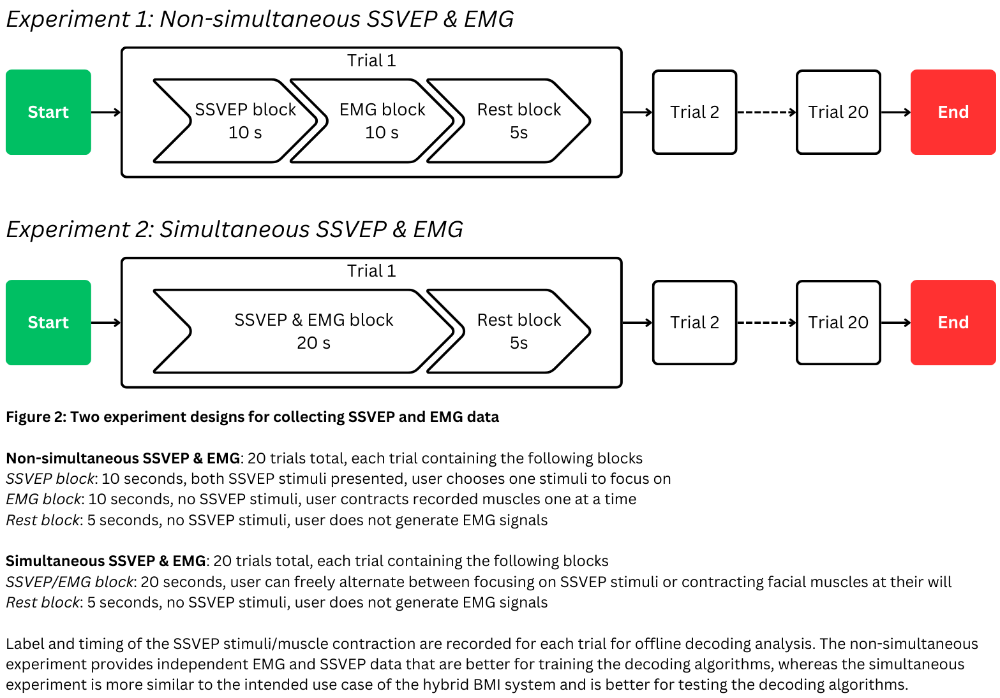
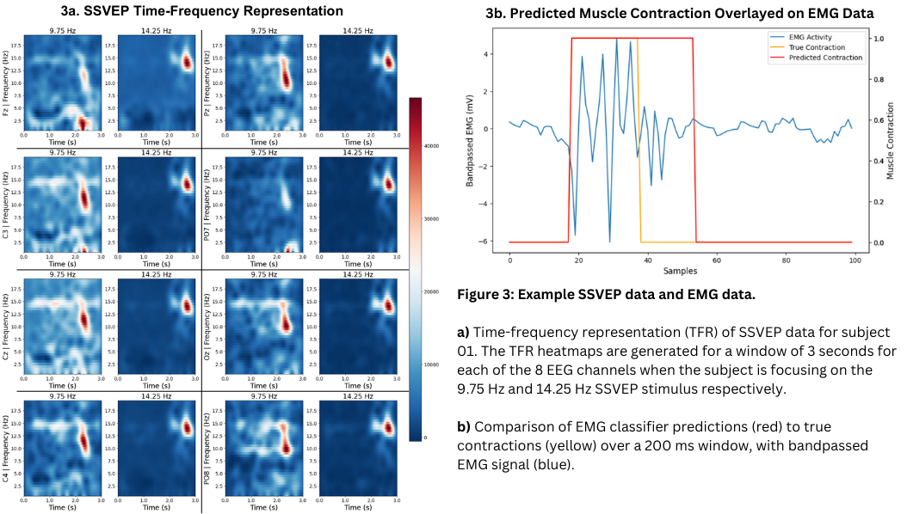
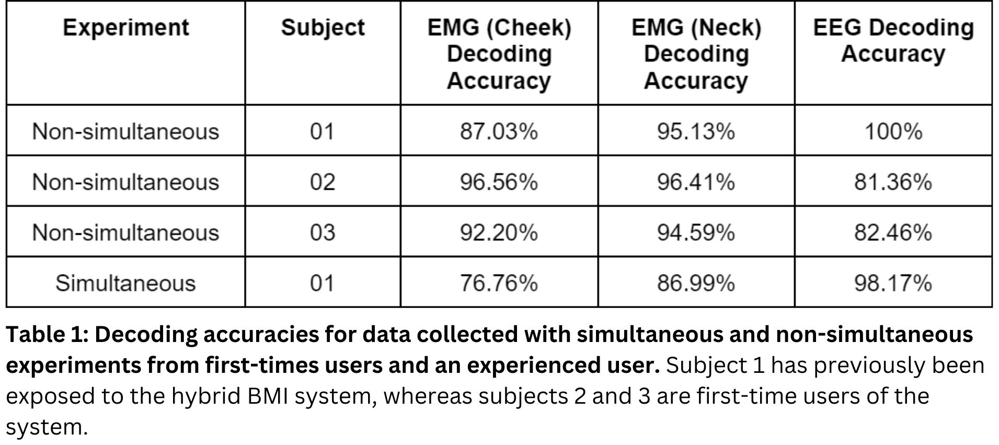

# EEG+EMG Hybrid Brain Machine Interface for Robotic Vehicle Control

# Introduction

Brain-machine interfaces (BMIs) can significantly improve the quality of life for people living with severe motor impairments by enabling control of assistive devices, such as telepresence robots, through neural signals. Such devices promote the independence and self-determination of these individuals. In BMIs, two of the most commonly used non-invasive methods are surface electromyography (EMG) and surface electroencephalography (EEG). Surface EMG records neuromuscular activity from the skin, while surface EEG captures cortical brain activity from the scalp.

However, either EMG or EEG alone has limitations. Prolonged EMG use can lead to muscle fatigue and signal deterioration, while continuous cognitive control with EEG often results in mental fatigue and often requires weeks of training to achieve satisfactory accuracy. These factors make traditional EMG- or EEG-based BMIs challenging to learn and use, especially for controlling complex systems like telepresence robots.

This study introduces a novel hybrid BMI that employs both EEG steady-state visually evoked potentials (SSVEP) and EMG signals from cheek and neck muscles to control the locomotion as well as camera position of a telepresence robot. The system is able to decode user intention from EMG activity with over 95% accuracy and SSVEP with up to 100% accuracy. Furthermore, the system has potential to mitigate fatigue by allowing users to alternate between EEG and EMG, thereby reducing the continuous use of either. These results demonstrate the potential for hybrid BMis to enhance the usability and effectiveness of assistive technologies, thereby improving the quality of life for individuals with severe motor impairments.

# Materials & Methods

Users have access to two functions of the telepresence robot: locomotion and camera position, each having 2 degrees of freedom. Users switch the control paradigm by using an 8-channel EEG to produce SSVEP though focusing on one of the two SSVEP stimuli, each flashing at 9.75 Hz and 14.25 Hz. Control of the robot locomotion/camera view angle are executed via a 2-channel EMG (Fig. 1).

Two experiments, non-simultaneous and simultaneous EMG & EEG, are designed to collect data for training and testing the decoding algorithms (Fig. 2). The non-simultaneous experiment provides independent EMG and EEG data, whereas the simultaneous experiment provides intermixed EMG and EEG data and is more similar to the intended use case of the hybrid BMI.

Filters are applied to preprocess SSVEP and EMG signals. For SSVEP signals, a 2 Hz high pass filter and a 60 Hz notch filter are implemented using infinite impulse response (IRR) filters to preserve harmonics. For EMG signals, a 50-150 Hz bandpass exponential moving average (EMA) filter is applied. The EEG sensors sample at 250 Hz, while the EMG sensors sample at 500 Hz.

To decode the EMG signal, two separate logistic regression models are used to classify whether or not the cheek or neck muscles are contracting separately by comparing the signal with a threshold. The EMG classifiers are trained on rolling windows of 200 ms with an 80 ms overlap. A canonical correlation analysis (CCA) model is used to decode SSVEP stimuli from a 3-second window of EEG signals.

# Results

A time-frequency representation (TFR) (Fig. 3a) of the SSVEP signal for Subject 01 reveals clear differences in the distribution of frequency power for trials where the subject focused on the 9.75 vs. 14.25 Hz signal. These results are consistent with existing literature on the neuroscientific principles behind SSVEP. Analysis of the EMG classifier (Fig. 3b) compares the timing of the classifier’s prediction of a muscle contraction compared to the true label for a sample 200 ms window of EMG data. It can be observed that the prediction aligns well with the actual EMG signal bundle as well as the true label.

